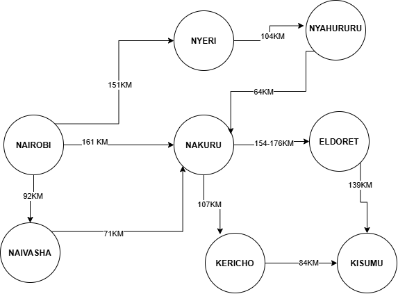
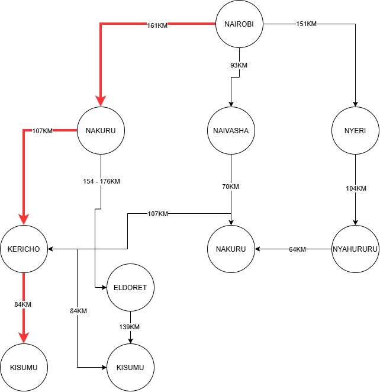

# Designing a Searching Agent

## Self-Driving Trailer
Group members : - **168869** - **191622** - **179447**

**INTRODUCTION**

This exercise focuses on designing a searching agent for a self-driving
trailer travelling through the Kenyan highway network from Nairobi to Kisumu.

The agent must be able to perceive its environment, make decisions about
which route to take, and identify an optimal path based on the distance
between towns.

## Question 1a) PEAS Framework

PEAS stands for Performance Measure, Environment, Actuators and Sensors.
It is used to describe the task environment and capabilities of an
intelligent agent.

### a) Performance Measure

The performance of the self-driving trailer is measured by its ability to safely travel from Nairobi to Kisumu while minimizing the total travel distance. Other performance measures include minimizing travel time and fuel consumption, avoiding accidents and obeying traffic rules.

### b) Environment

The environment is the Kenyan highway network connecting Nairobi with towns in the Central Highlands, Rift Valley and Lake Victoria Basin
regions. It includes highways, towns intersections, other vehicles, pedestrians, road conditions and weather conditions.

### c) Actuators

The actuators are the mechanisms through which the trailer acts on its environment. They include the steering system, accelerator,
braking system, gears or transmission indicators, horn and lights.

### d) Sensors

The sensors allow the trailer to perceive its environment. They include GPS, cameras, radar, LiDAR, speed sensors and other vehicle sensors used to detect roads, vehicles, obstacles and the trailer's position.

## Question 1b) Task Environment

The self-driving trailer operates in a complex road environment. The
environment can be classified using five properties: observability,
determinism, whether it is episodic or sequential, whether it is static
or dynamic, and whether it is single-agent or multi-agent.

### a) Observability — Partially Observable

The environment is partially observable because the information about the environment is not fully available to the trailer through its sensors. For example, vehicles may be hidden from view, pedestrians may suddenly enter the road and weather conditions may affect visibility. The trailer must therefore use the available sensor information to make informed decisions about its environment.

### b) Determinism — Stochastic

The environment is stochastic because it contains aspects that are beyond the control of the trailer. Traffic, pedestrians, weather,
road conditions and the behaviour of other road users can be unpredictable. Therefore, the trailer must make decisions while
dealing with uncertainty.

### c) Episodic or Sequential — Sequential

The environment is sequential because the choice of an action by the trailer depends on previous actions and affects future decisions.
For example, choosing a particular route from Nairobi determines which towns and roads the trailer can encounter later on its journey to
Kisumu.

### d) Static or Dynamic — Dynamic

The environment is dynamic because it can change while the trailer is selecting an action. Other vehicles and pedestrians are moving, traffic conditions can change, weather conditions can change and roads may
become blocked or congested. The trailer therefore needs to observe the environment before deciding what action to take.

### e) Single-Agent or Multi-Agent — Multi-Agent

The environment is multi-agent because the trailer operates alongside other agents including human drivers, pedestrians and other
self-driving vehicles. The actions of these agents can affect the trailer and influence its decisions while travelling.

# Question 2: Directed Graph and Search Tree

## Directed Graph

A **directed weighted graph** is used to represent the selected Kenyan highway network.

In the graph:

- Each town or city is represented as a **node**.
- Each highway connection is represented as a **directed edge**.
- The distance between towns is represented as the **edge weight**.
- Nairobi is the **initial state**.
- Kisumu is the **goal state**.

The selected highway connections and their distances are:

| From | To | Distance |
|---|---|---:|
| Nairobi | Nakuru | 161 km |
| Nairobi | Naivasha | 93 km |
| Naivasha | Nakuru | 70 km |
| Nairobi | Nyeri | 151 km |
| Nyeri | Nyahururu | 104 km |
| Nyahururu | Nakuru | 64 km |
| Nakuru | Kericho | 107 km |
| Kericho | Kisumu | 84 km |
| Nakuru | Eldoret | 171 km |
| Eldoret | Kisumu | 139 km |

---

## Search Tree

The **search tree** represents the possible routes that the self-driving trailer can take from Nairobi to Kisumu.

The search problem is represented as follows:

- **Initial state:** Nairobi
- **Goal state:** Kisumu
- **States:** Towns and cities
- **Actions:** Travelling from one connected town to another
- **Path cost:** Distance travelled between towns
- **Goal test:** Reaching Kisumu

## Abstraction

**Abstraction** is applied by representing only the information necessary for route searching.

The search tree does not include unnecessary details such as individual buildings, vehicles, pedestrians, road signs or other physical features.

**Abstraction-based search tree from Nairobi to Kisumu.**

## Question 3 Path Cost Function

The path cost is calculated using the total distance travelled between towns.

For example:

**Nairobi - Nakuru - Kericho - Kisumu**

**161 + 107 + 84 = 352 km**

## Determining the Optimal Path

The possible paths from **Nairobi to Kisumu** were compared using their total distance.

| Route | Calculation | Total Distance |
|---|---|---:|
| Nairobi - Nakuru - Kericho - Kisumu | 161 + 107 + 84 | **352 km** |
| Nairobi - Naivasha - Nakuru - Kericho - Kisumu | 93 + 70 + 107 + 84 | **354 km** |
| Nairobi - Nakuru - Eldoret - Kisumu | 161 + 171 + 139 | **471km** |
| Nairobi - Nyeri - Nyahururu - Nakuru - Kericho - Kisumu | 151 + 104 + 64 + 107 + 84 | **510 km** |

## Optimal Path

The optimal path is:

**Nairobi - Nakuru - Kericho - Kisumu**

The total distance is:

**161 + 107 + 84 = 352 km**

Therefore, the self-driving trailer should travel through **Nakuru and Kericho** before reaching **Kisumu**, because this route has the **lowest total path cost of 352 km** among the routes considered.
